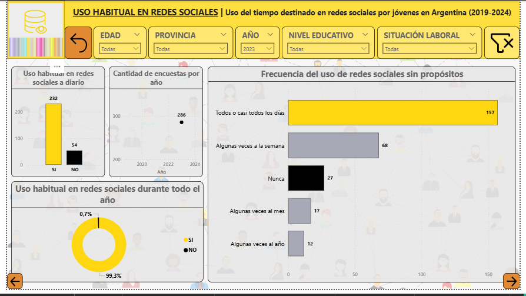
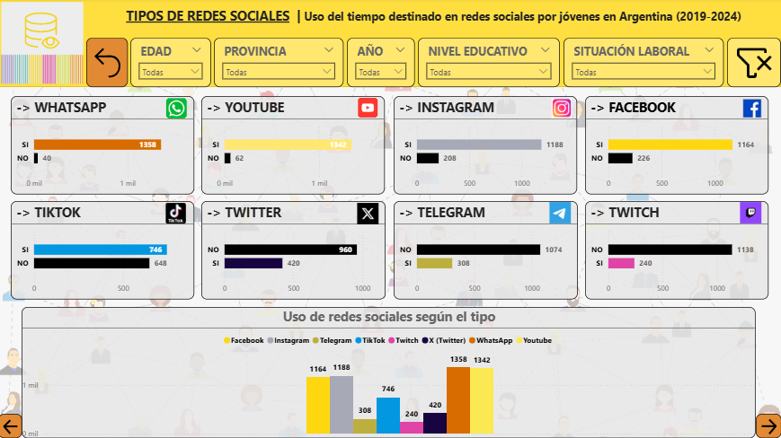

# Proyecto 1 | Uso del tiempo destinado a redes sociales por jóvenes en Argentina (Power BI)

Análisis exploratorio de datos desarrollado en **Power BI** a partir de información de la **Encuesta Nacional de Consumos Culturales**, con el objetivo de estudiar los hábitos de uso de redes sociales de jóvenes de 18 a 29 años en Argentina.

---

## Descripción

Este proyecto desarrolla un análisis exploratorio de datos sobre el tiempo destinado al uso de redes sociales por jóvenes de 18 a 29 años en Argentina. A partir de una base de datos pública se llevó a cabo un proceso completo de preparación, transformación, modelado y visualización de la información para construir un dashboard interactivo que facilite la exploración de los datos y la comunicación de los principales hallazgos.

El análisis aborda el uso de plataformas como **WhatsApp, Facebook, Instagram, X (Twitter), TikTok, YouTube, Twitch y LinkedIn**, incorporando además variables relacionadas con las prácticas digitales, la conectividad, los dispositivos de acceso y distintas características sociodemográficas de la población.

---

## Objetivo

El objetivo del proyecto fue analizar el tiempo destinado al uso de redes sociales por jóvenes de 18 a 29 años en Argentina mediante el desarrollo de un proceso integral de análisis de datos.

Para ello se buscó:

- Analizar los hábitos de uso de las siguientes redes sociales: WhatsApp, Facebook, Instagram, X (Twitter), TikTok, YouTube, Twitch y LinkedIn.
- Identificar las plataformas con mayor nivel de utilización por parte de la población estudiada.
- Explorar las principales prácticas realizadas dentro de las redes sociales.
- Analizar la relación entre el uso de las redes sociales y variables sociodemográficas como el nivel educativo y la situación laboral.
- Examinar las condiciones de conectividad y los dispositivos utilizados para acceder a Internet.

---

## Fuente de datos

Los datos utilizados provienen de la **Encuesta Nacional de Consumos Culturales**, una fuente pública empleada para el desarrollo de este proyecto.

La información fue consultada durante el año **2024**.

---

## Herramientas utilizadas

- Microsoft Excel
- Power Query
- Power BI
- DAX
- Diagramas.net

---

## Metodología

El desarrollo del proyecto comprendió las siguientes etapas:

1. Exploración y selección de la información.
2. Limpieza y transformación de los datos mediante Power Query.
3. Diseño del modelo relacional de datos.
4. Creación de tablas de dimensiones, tabla calendario y medidas mediante DAX.
5. Desarrollo de un dashboard interactivo compuesto por cinco páginas temáticas.
6. Análisis e interpretación de los resultados obtenidos.

---

## Dashboard

El dashboard desarrollado en Power BI permite explorar de forma interactiva indicadores relacionados con el uso de WhatsApp, Facebook, Instagram, X (Twitter), TikTok, YouTube, Twitch, Snapchat, Pinterest, LinkedIn y Tinder mediante filtros dinámicos por edad, provincia, año, nivel educativo y situación laboral.

### Vista general

### Análisis por tipo de red social

---

## Principales hallazgos

El análisis permitió identificar, entre otros resultados, que:

- WhatsApp y YouTube fueron las plataformas con mayor nivel de utilización entre las personas encuestadas.
- Instagram y TikTok presentaron una alta frecuencia de uso entre los jóvenes analizados.
- El celular fue el principal dispositivo utilizado para acceder a Internet y a las redes sociales.
- La incorporación de filtros dinámicos permitió comparar los hábitos de uso según variables como edad, nivel educativo, situación laboral y ubicación geográfica.

---

## Estructura del repositorio

- `Dashboard.pbix` → Dashboard desarrollado en Power BI.
- `Base.xlsx` → Base de datos utilizada para el análisis.
- `Informe.pdf` → Documentación completa del proyecto.
- `assets/` → Capturas del dashboard y recursos gráficos.

---

## Evolución del proyecto

Este proyecto constituye la primera etapa de un mismo caso de estudio.

Como complemento de este proyecto se desarrolló un segundo análisis utilizando R, basado en la misma temática y en información proveniente de la Encuesta Nacional de Consumos Culturales. Dicho proyecto incorpora un flujo de trabajo reproducible mediante programación y un informe dinámico en formato HTML.

---

## Autor

**Benicio Armendano**

Licenciado en Sociología | Analista de Datos Junior
